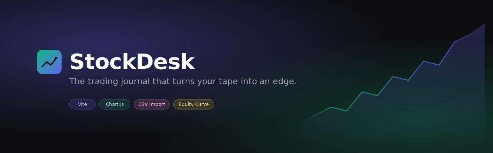

<div align="center">



<br/>

# StockDesk

**The trading journal that turns your tape into an edge.**
A self-hosted, full-stack alternative to TradeZella — premium UI, real authentication, your data.

[](https://vitejs.dev/)
[](https://nodejs.org/)
[](https://expressjs.com/)
[](https://www.mongodb.com/)
[](https://socket.io/)
[](https://jwt.io)
[](LICENSE)

[Quickstart](#quickstart) · [Features](#what-it-does) · [Architecture](#architecture) · [Frontend](frontend/) · [Backend](backend/)

</div>

<br/>

## Why StockDesk

Most trading-journal tools are either bloated SaaS subscriptions you don't own, or spreadsheets that can't keep up with you. **StockDesk** is the third path — a polished, self-hostable trading journal with the feel of a paid product. You bring the discipline; it brings the structure, the analytics, and the equity curve.

This is a complete full-stack product — Vite frontend talking to a hardened Node + MongoDB API — built to ship.

<br/>

## What it does

<table>
<tr>
<td width="50%" valign="top">

### Live dashboard
Filtered P&L, win rate, average risk/reward, and a multi-symbol cumulative equity curve that updates the moment you log a trade.

</td>
<td width="50%" valign="top">

### Trade ledger
Every long and short you've taken, with computed R:R and color-coded P&L. Sortable, filterable, exportable.

</td>
</tr>
<tr>
<td width="50%" valign="top">

### Calendar heatmap
A trader's calendar view — daily P&L color-coded across the month, journal entries flagged on the same grid. See your patterns in one glance.

</td>
<td width="50%" valign="top">

### Daily reflection journal
Bullish, bearish, or neutral — capture the why behind every session. One entry per day, linked to the trades you took.

</td>
</tr>
<tr>
<td width="50%" valign="top">

### CSV import
Drag any broker export onto the import zone. Auto-detects the columns, lets you remap them, bulk-imports the rows server-side.

</td>
<td width="50%" valign="top">

### Real authentication
JWT access + refresh tokens, bcrypt-hashed passwords, session expiry handling. Sign up, sign in, your data is yours alone.

</td>
</tr>
<tr>
<td width="50%" valign="top">

### Real-time market data
Built-in geometric-random-walk price simulator pushes ticks every two seconds over Socket.IO. No external API keys required.

</td>
<td width="50%" valign="top">

### Production-grade backend
Helmet, CORS, rate limiting, gzip, central error handler, validated endpoints, Jest + Supertest tests. Ready to deploy on day one.

</td>
</tr>
</table>

<br/>

## Architecture

```
┌──────────────────────────┐      REST       ┌──────────────────────────┐    Mongoose    ┌────────────┐
│   Frontend (Vite)        │ ─────────────▶  │   Backend (Express)      │ ────────────▶  │  MongoDB   │
│                          │ ◀─────────────  │                          │                └────────────┘
│   Vanilla JS + Chart.js  │   WebSocket     │   Socket.IO + Simulator  │
│   Glassmorphism UI       │ ◀─────────────  │   JWT Auth + Bcrypt      │
└──────────────────────────┘                 └──────────────────────────┘
       /frontend                                      /backend
```

<br/>

## Quickstart

You'll run two services side by side: the API and the frontend.

### 1. Clone & install

```bash
git clone https://github.com/erikojeda01/stock-desk-1.0.git
cd stock-desk-1.0
```

### 2. Start the backend

```bash
cd backend
npm install
cp .env.example .env             # set JWT_SECRET, JWT_REFRESH_SECRET
brew services start mongodb-community
npm run seed                     # optional: load demo data
npm run dev                      # starts on http://localhost:4000
```

### 3. Start the frontend (new terminal tab)

```bash
cd frontend
npm install
npm run dev                      # opens on http://localhost:5173
```

Open <http://localhost:5173>, click the green **Try the demo** pill on the sign-in screen, and you're in.

> **Demo credentials**: `demo@stockdesk.io` / `demo1234`

<br/>

## Project layout

```
stock-desk-1.0/
├── frontend/                Vite + vanilla JS app
│   ├── index.html           shell, modals, view containers
│   ├── app.js               navigation + global UI
│   ├── api.js               fetch wrapper, JWT auth, refresh handling
│   ├── auth-ui.js           login / register overlay
│   ├── store.js             state container — talks to the API
│   ├── styles.css           design system (glassmorphism, Inter)
│   └── js/                  per-view modules: dashboard, trades, calendar, journal, import
│
├── backend/                 Node + Express + MongoDB API
│   ├── src/
│   │   ├── app.js           express app factory
│   │   ├── server.js        bootstrap: db + http + sockets + simulator
│   │   ├── config/          env, db
│   │   ├── models/          User, Trade, JournalEntry, Portfolio, Holding,
│   │   │                    Watchlist, Transaction, Stock
│   │   ├── controllers/     request handlers
│   │   ├── routes/          express routers
│   │   ├── middleware/      auth, validate, errorHandler
│   │   ├── services/        tokenService, marketSimulator
│   │   ├── sockets/         Socket.IO setup
│   │   └── utils/           logger, ApiError
│   ├── scripts/seed.js      demo data seeder
│   └── tests/               Jest + Supertest
│
├── README.md                this file
├── LICENSE                  MIT
└── .github/banner.svg       hero
```

<br/>

## Tech stack

**Frontend** — Vite, vanilla JavaScript modules, Chart.js, Phosphor Icons, custom design tokens (Inter type, glassmorphism, neutral dark palette).

**Backend** — Node 18+, Express, Mongoose / MongoDB, Socket.IO, JSON Web Tokens, bcrypt, express-validator, Jest + Supertest, helmet, cors, express-rate-limit, compression, morgan.

<br/>

## Design system

| Token | Value |
|---|---|
| Primary | `#6366f1` (indigo) |
| Success | `#10b981` (emerald) |
| Danger  | `#ef4444` (rose) |
| Background | `#0a0a0c` |
| Surface | `rgba(20,20,24,.8)` with backdrop blur |
| Type | Inter, 300 / 400 / 500 / 600 / 700 |

Glassmorphism panels, gradient CTAs, soft inner shadows. Tuned for late-night chart sessions.

<br/>

## Roadmap

- [x] Full-stack MVP — auth, trades, journal, calendar, dashboard
- [x] CSV bulk import
- [x] Real-time market data simulator
- [ ] Strategy tagging + filterable analytics
- [ ] AI Coach view backed by your trade history
- [ ] Mobile-first responsive layout
- [ ] PWA (offline-first journal)
- [ ] OAuth (Google, GitHub) sign-in
- [ ] One-click deploy (Railway / Render)

<br/>

## License

MIT — see [LICENSE](LICENSE).

<div align="center">

Built by [Erik Ojeda](https://github.com/erikojeda01).
If this is useful, [star the repo](https://github.com/erikojeda01/stock-desk-1.0).

</div>
